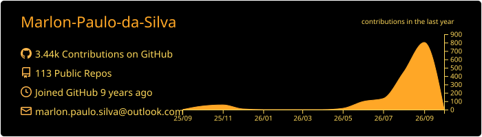
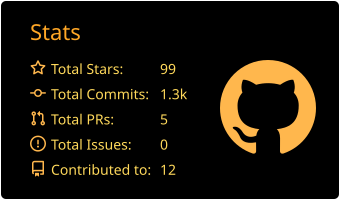
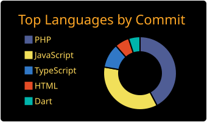

🇺🇸 **English** · [🇧🇷 Português](README.pt-BR.md)

  
  
  
  

---

### 👨‍💻 About me

**Back-end developer** at [ImobiBrasil](https://www.linkedin.com/company/imobibrasil/), building software for the real estate market.

- 🔭 Working with **PHP, MySQL, Node.js** and API integrations
- 🌱 Currently learning: **<!-- e.g. TypeScript, Docker, applied AI -->**
- 💬 Ask me about **PHP, JavaScript, React, React Native, Node.js**
- ▶️ I (not so) regularly post videos on [YouTube](https://www.youtube.com/channel/UCKU_aeUdXC5D7ky7WS98ZaQ)
- 📫 Reach me on [LinkedIn](https://www.linkedin.com/in/marlon-paulo/)

### 🛠 Tech Stack

  

### 🚀 Featured projects

| Project | Description | Stack |
|---|---|---|
| [**TikTok-Clone-ReactNative**](https://github.com/Marlon-Paulo-da-Silva/TikTok-Clone-ReactNative)  | TikTok clone with a full-screen video feed | React Native · Expo |
| [**CRUD-MVC-PHP**](https://github.com/Marlon-Paulo-da-Silva/CRUD-MVC-PHP) | CRUD built on a custom MVC architecture in pure PHP, with its own router, middlewares, sessions, admin area and REST API (v1) | PHP · MySQL |
| [**SabeOfertas**](https://github.com/Marlon-Paulo-da-Silva/SabeOfertas) | Real-time deals finder for people walking around retail areas | React · React Native · Node.js |
| [**InstagramClone-FeaturesOnScroll**](https://github.com/Marlon-Paulo-da-Silva/InstagramClone-FeaturesOnScroll) ⭐ 6 | Instagram clone with image loading effects on scroll | React Native |
| [**Buscar-valores-selic**](https://github.com/Marlon-Paulo-da-Silva/Buscar-valores-selic) | Looks up Brazil's Selic rate for a date range using the Central Bank open data API | React |

### 📊 GitHub Analytics

### 🐍 Contributions

<picture>
  <source media="(prefers-color-scheme: dark)" srcset="https://raw.githubusercontent.com/Marlon-Paulo-da-Silva/Marlon-Paulo-da-Silva/output/github-snake-dark.svg" />
  
</picture>
