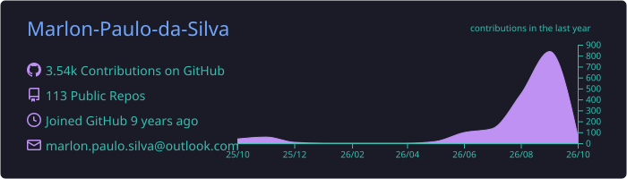
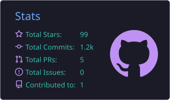
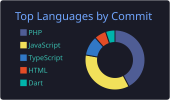

[🇺🇸 English](README.md) · 🇧🇷 **Português**

  
  
  
  

---

### 👨‍💻 Sobre mim

Desenvolvedor **Back-end** na [ImobiBrasil](https://www.linkedin.com/company/imobibrasil/), construindo soluções para o mercado imobiliário.

- 🔭 Trabalhando com **PHP, MySQL, Node.js** e integrações de APIs
- 🌱 Estudando atualmente: **<!-- ex.: TypeScript, Docker, IA aplicada -->**
- 💬 Pode me perguntar sobre **PHP, JavaScript, React, React Native, Node.js**
- ▶️ De vez em quando posto vídeos no [YouTube](https://www.youtube.com/channel/UCKU_aeUdXC5D7ky7WS98ZaQ)
- 📫 Fale comigo pelo [LinkedIn](https://www.linkedin.com/in/marlon-paulo/)

### 🛠 Tech Stack

  

### 🚀 Projetos em destaque

| Projeto | Descrição | Stack |
|---|---|---|
| [**TikTok-Clone-ReactNative**](https://github.com/Marlon-Paulo-da-Silva/TikTok-Clone-ReactNative)  | Clone do TikTok com feed de vídeos em tela cheia | React Native · Expo |
| [**CRUD-MVC-PHP**](https://github.com/Marlon-Paulo-da-Silva/CRUD-MVC-PHP) | CRUD com arquitetura MVC própria em PHP puro, com roteador, middlewares, sessões, área administrativa e API REST (v1) | PHP · MySQL |
| [**SabeOfertas**](https://github.com/Marlon-Paulo-da-Silva/SabeOfertas) | Busca de ofertas em tempo real para quem está andando pelo comércio | React · React Native · Node.js |
| [**InstagramClone-FeaturesOnScroll**](https://github.com/Marlon-Paulo-da-Silva/InstagramClone-FeaturesOnScroll) ⭐ 6 | Clone do Instagram com efeitos de carregamento no scroll | React Native |
| [**Buscar-valores-selic**](https://github.com/Marlon-Paulo-da-Silva/Buscar-valores-selic) | Consulta a taxa Selic em um intervalo de datas pela API de dados abertos do Banco Central | React |

### 📊 GitHub Analytics

### 🐍 Contribuições

<picture>
  <source media="(prefers-color-scheme: dark)" srcset="https://raw.githubusercontent.com/Marlon-Paulo-da-Silva/Marlon-Paulo-da-Silva/output/github-snake-dark.svg" />
  
</picture>
